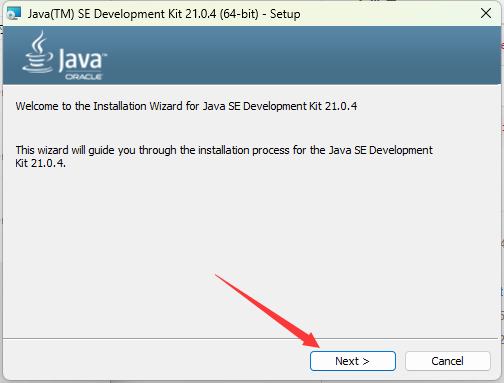
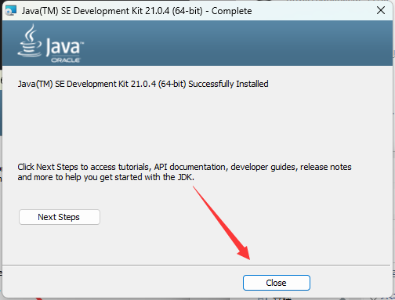
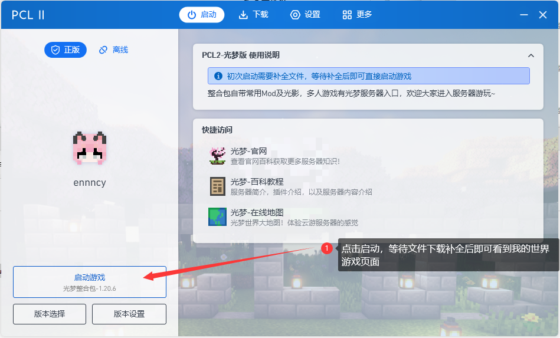

---ewiki-config---
create_at=2024/7/27 15:24:43
update_at=2024/12/26 22:00:00
sidebar=整合包使用教程
---ewiki-config---

 [<-返回主页目录](../index.html#目录)

# **整合包使用教程**

> 整合包内容详情请看：[整合包详情](./2_pack_info.md)

## 1.获取资源

> 加入 QQ 群： `876616313`
> 下载群文件整合包里面的2个文件：

| 文件名                  | 描述                                                                        |
| ----------------------- | --------------------------------------------------------------------------- |
| `jdk-21-xxx.msi`            | Java 运行环境                                                               |
| `光梦整合包-xxx.zip`        | PCL2 我的世界启动器压缩包（感谢[龙腾猫跃](https://afdian.com/a/LTCat)大大开发的启动器！）  内含多个常用模组以及光影 | 

## 2.安装 JAVA 环境

> 点击下载好的 `jdk-21-xxx.msi` 文件，按照提示安装 Java 运行环境。
> 如果中途提示 `是否允许此应用对设备进行更改`，请点击 `是`。

最后点击 `close` 按钮，到此 JAVA 环境已经安装完毕。

---

## 3.解压&启动整合包

> 将下载好的 `光梦整合包-xxx.zip` 文件，移动到你的游戏目录下（例如：`D:/game`），并解压缩 。
> 解压缩后，运行 `Plain Craft Launcher 2.exe` 文件，并启动游戏，等待文件补全后即可开始游玩。

---

::: warn **警告**

1. 启动 PCL2 后，会在启动器目录下面生成很多文件，不要删除这些文件，否则会导致启动器无法正常使用。
2. 并且不要尝试放置在桌面，这会导致文件全部生成在桌面。
3. 如果想在桌面访问，可以右键启动器文件，点击 `发送到`，选择 `桌面快捷方式` （`win11`在`更多选项`中）。

 

## 整合包详情
 
 光梦整合包 1.21
> 基于 MC 1.21 + fabric 0.16.9 的整合包
> 内置 `Complementary`，`photon` 光影

模组列表：

