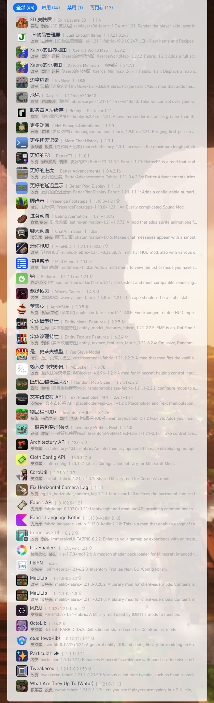

---ewiki-config---
create_at=2024/7/27 21:06:28
update_at=2024/12/26 21:57:57
sidebar=整合包详情
---ewiki-config---

# 光梦整合包 1.21
> 基于 MC 1.21 + fabric 0.16.9 的整合包
> 内置 `Complementary`，`photon` 光影

模组列表：

