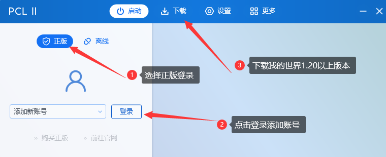
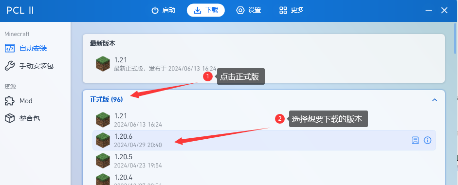
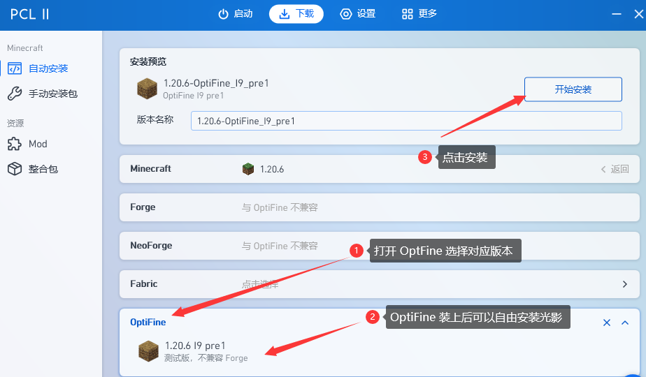
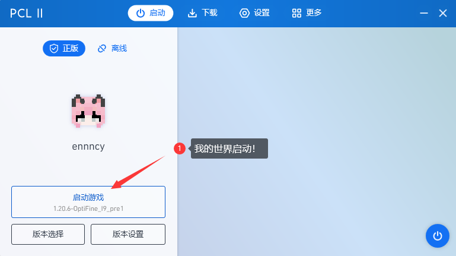
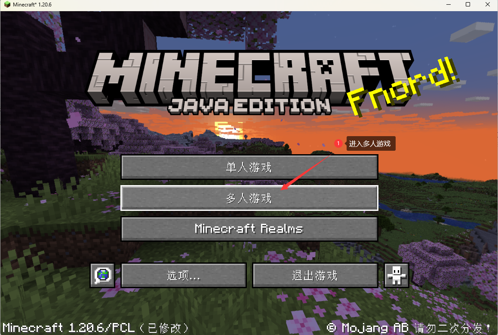
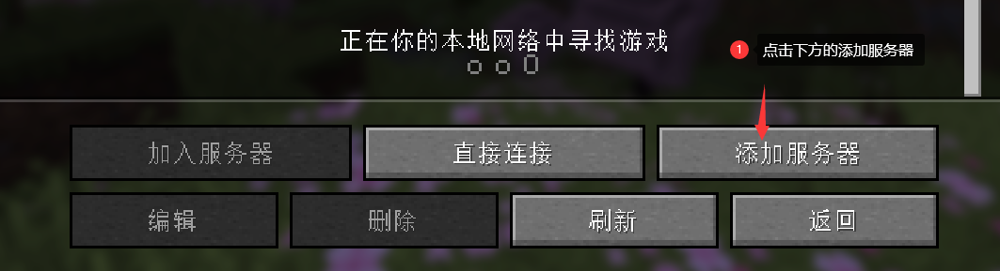
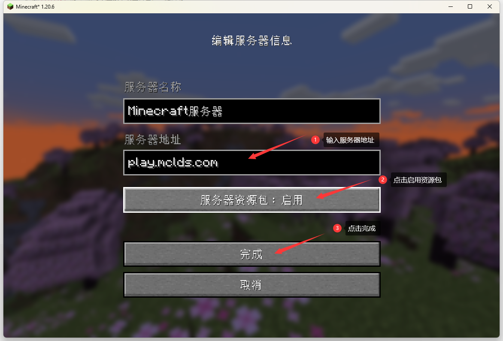
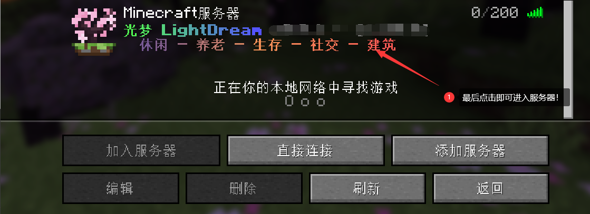

---ewiki-config---
create_at=7/14/2024, 7:44:26 PM
update_at=2024/12/26 21:57:57
sidebar=新手入门教程
---ewiki-config---

 [<-返回主页目录](../index.md#目录)

 

# **新手入门教程**

> 加`百科首页` 的QQ群 可获取全部资源（Java环境，启动器，整合包，包括光影以及常用模组）
> 快速使用整合包请查看：[整合包使用教程](./1_pack_guide.md)

### 1.下载我的世界启动器
> 以下排名不分先后

|启动器| 链接| 
|---|---|
|PCL2 | 主页： [https://afdian.com/a/LTCat](https://afdian.com/a/LTCat)   下载页：[https://ltcat.lanzouv.com/b0aj6gsid](https://ltcat.lanzouv.com/b0aj6gsid) | 
|HMCL | 主页： [https://hmcl.huangyuhui.net/](https://hmcl.huangyuhui.net/)   下载页：[https://hmcl.huangyuhui.net/download/](https://hmcl.huangyuhui.net/download/) | 
|官方启动器| [https://www.minecraft.net/zh-hans/download](https://www.minecraft.net/zh-hans/download) |

### 2.安装&启动
 
> 目前 1.21 版本暂不支持，建议下载 1.20.6 版本

---

---

---

---

---

---

---

  