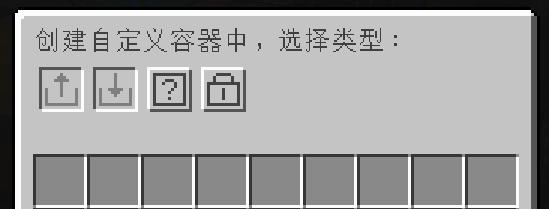
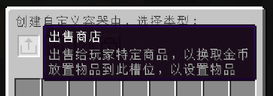
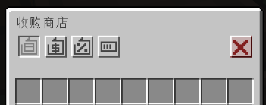

---ewiki-config---
sidebar=自定义容器
create_at=2024/7/16 12:48:30
update_at=2024/12/26 21:57:57
---ewiki-config---

# 自定义容器

::: info
店家：对准 `木桶` 通过 `双击F键` 将打开自定义容器菜单，店家可以随意创建容器，点击移除按钮后容器功能将失效（不会移除物品）
玩家：对准 `容器` 通过 `双击F键` 可以查看容器里面的内容，但无法进行拿取，`右键` 容器执行则进行对应的容器功能
:::

**实机图片**
   
 

| 容器     | 说明                                                                                                                                        |
| -------- | ------------------------------------------------------------------------------------------------------------------------------------------- |
| 出售商店 | 设置`出售`物品后，在箱子里存放物品即可对外出售，可以设置金额                                                                                |
| 收购商店 | 设置`收购`物品后，设置收购金额以及目标，每次收购会扣除店家的金币，达到目标后将不再收购， 可以设置收购物品的磨损率                        |
| 随机商店 | 玩家购买后将`随机获取`商店里面的物品，可以提前使用 `双击F键` 打开容器查看物品，但无法拿取                                                   |
| 权限箱   | 玩家创建权限箱后，可以指定 `私人` `好友` `所有人`   几个权限，（在`领地内`如果设置为`所有人`，那其他人可以进行拿取的，将`无视领地权限`） |
