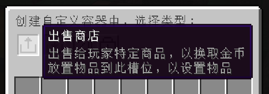

---ewiki-config---
sidebar=生存服杂项&特性
---ewiki-config---

 [<-返回主页目录](../index.html#目录)

## 生存服杂项&特性

> 以下特性腐竹有空会更新

### 📦 快捷潜影盒

拿着潜影盒对着空气右键即可打开潜影盒，关闭后潜影盒将自动返还。

### ⚒️ 盔甲架编辑

拿着`菜单实体物品`，或者`双击F`(服务器菜单键)，对着`盔甲架`打开菜单，即可出现盔甲架编辑页面，可以旋转盔甲架各个部位以及大小、底盘、手臂等显示调整。

### 📦 特色木桶（自定义容器）

::: info
店家：对准 `木桶` 通过 `双击F键` 将打开自定义容器菜单，店家可以随意创建容器，点击移除按钮后容器功能将失效（不会移除物品）
玩家：对准 `容器` 通过 `双击F键` 可以查看容器里面的内容，但无法进行拿取，`右键` 容器执行则进行对应的容器功能
:::

  

| 容器     | 说明                                                                                                                                                                                                |
| -------- | --------------------------------------------------------------------------------------------------------------------------------------------------------------------------------------------------- |
| 出售商店 | 设置`出售`物品后，在箱子里存放物品即可对外出售，可以设置金额                                                                                                                                        |
| 收购商店 | 设置`收购`物品后，设置收购金额以及目标，每次收购会扣除店家的金币，达到目标后将不再收购， 可以设置收购物品的磨损率                                                                                |
| 随机商店 | 玩家购买后将`随机获取`商店里面的物品，可以提前使用 `双击F键` 打开容器查看物品，但无法拿取                                                                                                           |
| 权限箱   | 玩家创建权限箱后，可以指定 `私人` `好友` `密码` `所有人`   几个权限，（在`领地内`如果设置为`所有人`，那其他人可以进行拿取的，将`无视领地权限`）， 如果设置为`密码箱`，则玩家需要输入密码才能打开 |
| 信箱     | 其他玩家可以向信箱投递物品，信件会记录玩家投递的信件内容，拿着信件对着空气右键可进行拆开和封存两个不同的信件状态                                                                                    |

### 🤝 玩家交互&玩家菜单

服务器提供了很多丰富的交互方式。打开玩家菜单后可对改玩家进行查看信息、传送、私信、加好友、交易等功能

| 操作               | 功能           |
| ------------------ | -------------- |
| 对着玩家 `双击F键` | 打开玩家菜单   |
| 点击玩家聊天框名字 | 打开玩家菜单   |
| 点击玩家聊天框头像 | 发送私信给玩家 |

### 🌏 聊天记录&跨服聊天

服务器已实现跨服聊天和聊天记录功能，每次登录进服都会自动加载上次聊天记录，聊天记录会 `100` 条最新的聊天记录。

跨服聊天时，聊天文字前方会显示世界标记 🌏

### 🧱 便民广告栏

在主城中可找到便民广告栏，右键可任意修改，目前并未做限制，请各位玩家自觉维护秩序，不要恶意修改。

### 😺 宠物系统

打开服务器菜单后，在下方个人菜单中即可找到，玩家可以在 `主城工具商` 那购买宠物 `捕捉物品`，找到宠物系统中规定可捕捉的宠物后，即可使用捕捉物品进行捕捉，捕捉后再次打开宠物系统即可看到宠物信息。

宠物会 `自动跟随` ，`传送`，帮助你进行更好的冒险！

### 👮‍♀️ 小黑屋

在主城`樱花树底部`中可以找到小黑屋监狱，被腐竹封禁的玩家会显示在`监狱列表`中，每个玩家必须`服刑`至指定的日期才可释放，玩家们可向腐竹举报`熊孩子`、`恶意玩家`等，经过核实后腐竹会对其采取相应的封禁措施。
