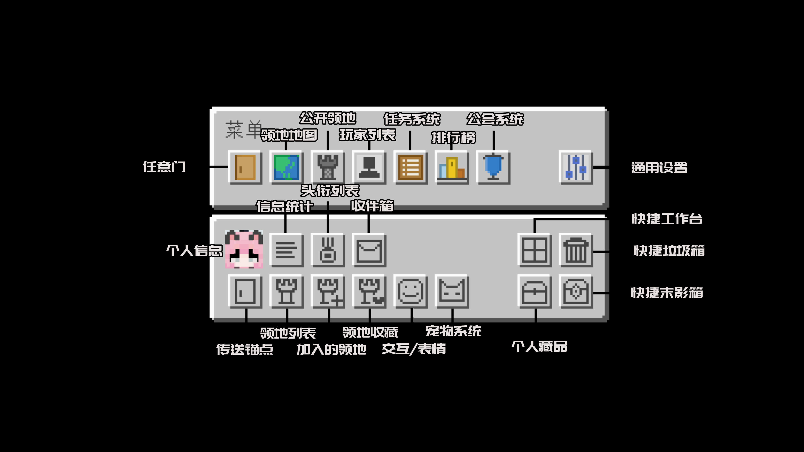
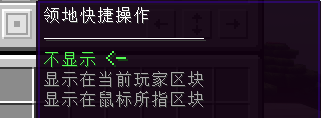

---ewiki-config---
sidebar=服务器菜单
---ewiki-config---

 [<-返回主页目录](../index.md#目录)

# 服务器菜单

服务器菜单是生存服核心功能之一，提供了丰富的功能和交互方式，可以通过菜单进行各种操作。

 

- `任意门`：可传送至多个世界，还可以直接返回服务器主大厅
- `领地地图&菜单`：服务器圈地必备菜单，使用第三个按钮可快速圈地 
    - 或者点击领地地图对领地进行各种精细化操作
    - 使用上下左右方向键可对地图进行移动
- `公开领地`：查看每个玩家的精美建筑和机器！
- `任务系统`：查看当前任务和在线时长等奖励
- `排行榜`：记录每个玩家的排行数据
- `公会系统`：每个玩家可花费特定金币创建公会，三个人以上的公会可在名字前拥有特殊公会头衔显示。
- `通用设置`：可设置HUD抬头显示，个人隐私设置，个人聊天频道等
- `个人菜单`：可自行进服体验哦（表情交互中拥有叠叠乐，旋转大风车，变大变小等好玩的功能！）

