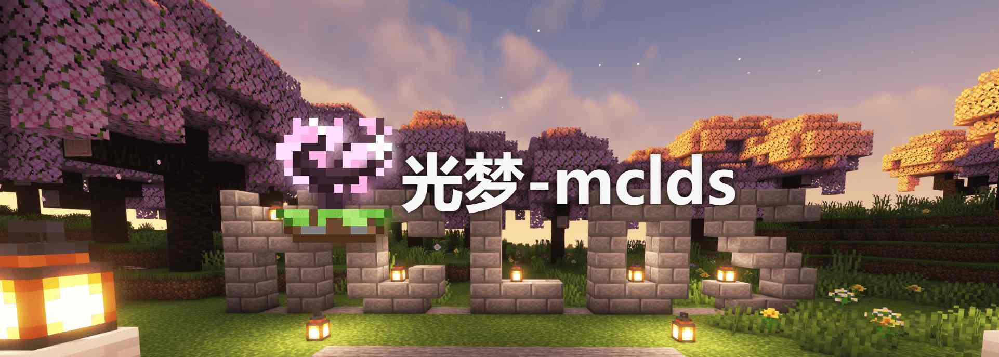

---ewiki-config---
create_at=7/14/2024, 7:44:26 PM
update_at=2024/12/26 21:57:57
sidebar=百科首页
---ewiki-config---

# 光梦

> light-dream (光明梦想，光之梦境，简称光梦)
> 光梦创立已有十年之久，前身是一个小服（梦殇之殛）发展而来，后续团队命名为 light dream studio (LDS)
> 经历了十年的分分合合，因为学业繁忙等各种原因导致没落，如今腐竹重启光梦计划，卷土重来。

## 服务器基本信息

| 信息           | 描述                     | 补充                                 |
| -------------- | ------------------------ | ------------------------------------ |
| 服务器域名(ip) | `play.mclds.com`         | 游戏中输入，不用填端口号             |
| 类型           | `公益服` `java` `插件服` | 服务端为 java paper 插件群组服          |
| 支持版本       | 1.20 及以上              | 不支持低版本                         |
| 人数上限       | 200                      | 暂时，后续需要看服务器能否撑住       |
| 正版验证       | 开启                     | 一直开启                             |
| 外置登录       | 开启                     | 使用 LittleSkin登录，无需正版验证                             |
| QQ 群          | `876616313`              | 有问题可以在群里交流或者艾特群主提问 |
 

## 核心玩法

| 玩法     | 描述                                                                                                                                                                            |
| -------- | ------------------------------------------------------------------------------------------------------------------------------------------------------------------------------- |
| 原版生存 | 将保持`与国际版同步更新`（尽量），与原版一致的原版生存玩法， 并且由此拓展出更多的玩法（地形，冒险，彩蛋等）。   
| 自研插件 | 服务器插件均由光梦自研，提供更多的玩法，更好的体验。   `精美菜单`, `领地插件`,`经济插件` 等等 详情插件列表请查看左侧： [服务器插件](./2-服务器插件/!_丰富UI界面.md) |
| 空岛生存 | （开发中）目前正在公测，预计2025暑假后停服，个根据暑期游玩情况调整空岛玩法     
| 小游戏 | （开发中）目前正在公测，已更新起床战争，躲猫猫等多个小游戏，后续将开发更多供大家游玩                           |
| 社区建设 | 服务器将会建设一个社区，让玩家可以在这里交流，建设，分享，创造，一起玩耍。  目前已有官网，Q 群，百科等基础建设。                                                            |

 
## 

**更多详情请在顶部目录查看**

---
